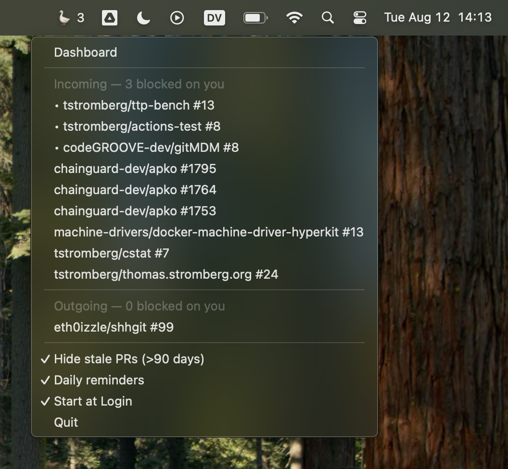

# Review Goose 🪿


[](https://github.com/ready-to-review/goose)


The only PR tracker that honks at you when you're the bottleneck. Now shipping with 100% more goose noises!

Lives in your menubar like a tiny waterfowl of productivity shame, watching your GitHub PRs and making aggressive bird sounds when you're blocking someone's code from seeing the light of production.



## What It Does

- **Honks** when you're blocking someone's PR (authentic goose noises included)
- **Jet sounds** when your own PR is ready for the next stage
- **Smart turn-based assignment** - knows who is blocking a PR, knows when tests are failing, etc.
- **Auto-start** on login (macOS)
- **Auto-open** incoming PRs in your browser (off by default, rate-limited)
- **Org Filtering** for orgs you may not care about in a home or work context

You can also visit the web-based dashboard at https://dash.ready-to-review.dev/

## Dependencies

* [go](https://go.dev/) 1.23.4 or higher
* [gh](https://cli.github.com/), AKA the GitHub command-line utility

## macOS Quick Start ⚡ (Get Honked At)

Install dependencies:

```bash
brew install gh go
```

Confirm that `gh` is properly authenticated:

```
gh auth status || gh auth login
```

Build & run:

```bash
git clone https://github.com/ready-to-review/goose.git
cd goose && make run
```

This will will cause the goose to implant itself into `/Applications/Review Goose.app` for future invocations. To be persistently annoyed every time you login, click the `Start at Login` menu item.

### Using a fine-grained access token

If you want more control over which repositories the goose can access, you can use a [fine-grained personal access token](https://github.com/settings/personal-access-tokens/new) with the following permissions:

- **Pull requests**: Read
- **Metadata**: Read

You can then use the token like so:

```bash
env GITHUB_TOKEN=your_token_here goose
```

We don't yet persist fine-grained tokens to disk - PR's welcome!

## Known Issues

- Visual notifications won't work on macOS until we release signed binaries.
- Blocking turn logic isn't 100% accurate - open an issue if you find something.
- The goose may not stop honking until you review your PRs
- Linux, BSD, and Windows support is implemented but untested

## Pricing

- Free forever for public repositories ❤️
- Private repo access will soon be a supporter-only feature to ensure the goose is fed. ($2.56/mo is our recommendation)

## Privacy

- Your GitHub token is used to authenticate against GitHub and codeGROOVE's API for state-machine & natural-language processing
- Your GitHub token is never stored or logged.
- PR metadata may be cached locally & remotely for up to 20 days
- No data is resold to anyone. We don't even want it.
- No telemetry is collected

---

Built with 🪿 by [codeGROOVE](https://codegroove.dev/) - PRs welcome!
